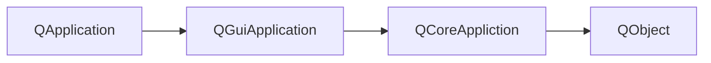
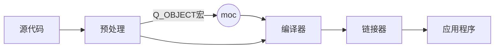
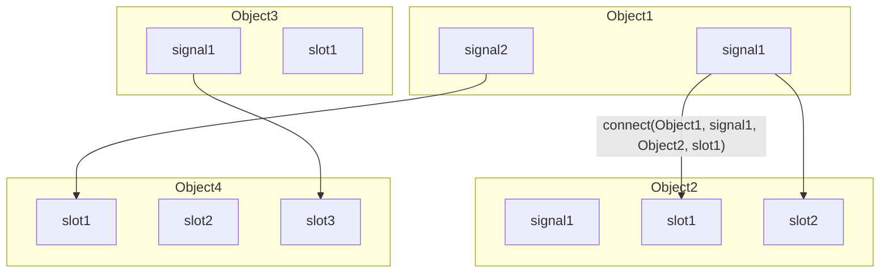

## Qt主事件循环

- QObject：包含Qt的元对象(meta object)系统
- QCoreApplication：为非GUI应用程序提供主事件循环
- QGuiApplication：为GUI应用程序提供主事件循环
- QApplication：为Qt Widgets模块的应用程序提供主事件循环

> ​	QCoreApplication 包含主事件循环，处理和分发来自操作系统和其他源的所有事件。它还处理应用程序的初始化和终结，以及系统范围和应用程序范围的设置
>
> ​	QGuiApplication 除了继承QCoreAplication的功能以外，还需负责初始化GUI所需的资源；跟踪系统界面属性，保证GUI与系统设置保持一致；提供字符串本地化、剪贴板，鼠标光标处理等功能。qGuiApp 是表示QGuiApplication对象的全局单例指针，当应用程序对象是QGuiApplication时有效。
>
> ​	QApplication 负责继承初始化Qt Widgets模块所需的资源，并提供更多的接口；QGuiAppliction 更多的使用操作系统本身的接口，比较轻量级。 qApp 是应用程序对象的全局指针
>
> ​	调用exec()方法进入主事件循环，直到调用exit()



​	`qDebug()`：在windows下，如果是控制台应用程序，则将消息发送到控制台；否则，它将被发送到调试器。

## 元对象系统(Meta-Object System)

- Qt 对标准C++进行了拓展，引入了一些新的概念和功能：

  - 信号槽机制
  - 属性
  - 内存管理

- QObject类是所有使用元对象系统的类的基类

  - 并不是所有Q开头的类都是QObject的派生类，例如QString

- 在一个类的private部分声明Q_OBJECT宏

- MOC(元对象编译器)为每个QObject的子类提供必要的代码

  - 元对象编译器(Meta-Object Compiler, MOC) 是一个预处理器，先将Qt的特性程序转换为标准C++程序，再由C++编译器进行编译。只有添加了Q_OBJECT宏，MOC才会对类里的信号和槽进行预处理。

  > 在Qt程序中，不管是否会用到信号槽机制，都最好加上Q_OBJECT宏
  >
  > Qt为C++语言增加的特性在Qt Core模块里实现，由Qt的元对象系统实现



### QObject不支持拷贝

QObject的拷贝构造函数和赋值运算符是私有的，并且使用了Q_DISABLE_COPY()宏。

> 为什么不支持拷贝：
>
>   QObject 做了很多额外的工作，如果可以拷贝则需要考虑很多东西，例如：
>
> - QObject::objectName可能是唯一的，如果复制一个Qt对象，应该给副本取什么名字
> - 复制的Qt对象在对象层次结构中，应该放在什么位置
> - Qt对象可以连接到其他对象向其发射信号和接受信号。如果复制Qt对象，该如何处理这些连接关系600
> - 可以在运行时添加未在C++类中声明新新属性。如果我们复制一个Qt对象，那么副本是否应该包括添加到原始对象中的属性
>
> 为了简单起见，干脆就不支持拷贝

### QObject的组织方式：对象树

- 当以另一个对象作为父对象创建QObject时，该对象将自动建家自身到父对象的子对象列表中
- 父对象删除时，它将自动删除其子对象。可以使用findChild()或findChildren()按名称和可选类型查找对象

> 如果只是需要通过QObject自动回收内存，无需moc系统，即无需添加Q_OBJECT。
>
> ​	虽然不是必须的，但仍建议在所有QObject子类中加上Q_OBJECT

## 信号与槽

​	所有GUI应用程序都是事件驱动的。事件主要有应用程序的用户生成，但也可以通过其它方式生成，例如Internet连接、窗口管理器或计时器。

   Qt具有独特的信号与插槽机制，它被用于对象之间的通信。solt是一种普通的C++函数：当与之相连的信号发出时，调用它。下面的图表示了信号与槽的调用关系



​    在使用信号与槽时，应该先这样对信号和槽进行声明：

```c++
"sender.h"
class sender: public QObject {
    ...
    signals:
    	void signalFunc();	// 信号函数必须无返回值，但可以有输入参数
    						// 信号函数无需实现(moc自动生成)，只需在某些情况下发射信号
    ...
}    
"sender.cpp"
void sender::actionFunc() {
    ...
    emit signalFunc();		// 发送函数
}

"receiver.h"
class receiver: public QObject {
    ...
    public slots:
    	void receiverFunc();	// 接收函数，这是一个普通函数
	...
}
"receiver.cpp"
void receiver::receiverFunc() {
    ...
}    
```

​	有几种连接信号和槽的方法：

- 使用成员函数指针(推荐)

  `connect(sender, &QObject::destroyed, this, &MyObject::objectDestroyed);`

  优点：允许编译器检查信号是否与槽的参数兼容；编译器可以隐式转换参数

- 使用仿函数或lambda表达式作为slot

  `connect(sender, &QObject::destoryed, this, [=](){this-> m_objects.remove(sender);});`

  使用仿函数，第三个this指针也是需要的，否则当this已经释放掉时，函数只知道this指针中指向的对象地址，会发生内存错误

- 使用SIGNAL和SOLT宏

  如果参数具有默认值，传递给SIGNAL()宏的签名的参数不得少于传递给SLOT()宏的签名的参数。使用这种方法发生拼写错误时，会比较难排查。

  ```c++
  connect(sender, SIGNAL(destroyed(QObject*)), 
          this, SLOT(objectDestroyed(QObject*)));
  ```

> connect还可以添加Qt::ConnectionType类型的参数，表示信号和槽之间的关联方式，在多线程时应该特别关注
>
> ```c++
> connect(const QObject *sender, const char *signal
>     const QObject &receiver, const char *member,
>     Qt::connectionType = Qt::AutoConnection);
> ```
>
> - Qt::AutoConnection(缺省值)：自动确定关联方式
> - Qt::DirectConnection：信号被发射时，槽立即执行，槽函数与信号在同一线程
> - Qt::QueuedConnection：事件循环回到接收者线程后执行槽，槽与信号不在同一线程
> - Qt::BlockingQueueConnection：信号线程会被阻塞直到槽执行完毕，当槽函数与信号在同一线程，会造成死锁。

## 属性系统

​	属性的行为类似类成员，但具有元对象系统的其它特性。

​	要声明属性，需要在继承QObject的类中使用Q_PROPERTY宏。P_PROPERTY宏定义一个返回类型为type，名称为name的属性。

```c++
// 属性系统的例子，遍历QObject中的每一个property
// 通过查询类的QObject, QMetaObject, QMetaProperties，可以在运行时发现类的属性
QObject *object = ...; // 一个QObject
const QMetaObject *metaObject = object->metaObject(); // 获取它的QMetaObject
int count = metaObject->propertyCount(); // 获取property的数量
for(int i = 0; i < count; i++) { // 遍历
    QMetaProperty metaProperty = metaObject->property(i);// 获取property
    const char *name = metaProperty.name(); // 获取名字
    // QVariant是可以装下任何值的类型， 类似于union
    QVariant value = object->property(name); // 获取该属性的值
    
}

//setProperty可以在运行时为类定义新的属性，称之为动态属性
QPushButton *button = new QPushButton;
QObject *object = button;//直接用Qbutton也可以
object->setProperty("flat", true);
bool isFlat = object->property("flat");
```


```c++
// 使用Q_PROPERTY声明属性
// QString-->指定属性类型
// title-->指定属性名称
// READ title-->获取属性的方法：title
// WRITE setTitle-->设置属性的方法：setTitle
// USER true-->设置属性是否为可编辑属性，true表示可以编辑
Q_PROPERTY(QString title READ title WRITE setTitle USER true);
// 除了静态属性外，还可以自定义动态属性
bool setProperty(const char *name, const QVariant &value);
// 动态属性属于类对象的实例，不满足元对象属性机制，不能使用元对象获取动态属性信息，但可使用QObject::property()进行属性值的获取。
QVariant property(const char *name) const;
```

​	对象系统其余的静态属性如下：

| 属性                | 作用                                                         |
| ------------------- | ------------------------------------------------------------ |
| RESET resetFunction | 表示重置属性为默认值， resetFunction不能有参数和返回值       |
| NOTIFY notifySignal | 表示指定与属性关联的信号notifySignal，即当属性值变化时就会触发信号notifySignal |
| REVISION int        | 设置版本号，默认为0                                          |
| DESIGNABLE bool     | 表示设置属性在Qt设计师的属性编辑器中是否可见，默认为true（可见） |
| SCRIPTABLE bool     | 表示设置属性是否可被脚本引擎访问，默认为true                 |
| STORED bool         | 设置保存对象状态时是否必须保存属性值，多数情况默认为true     |
| CONSTANT            | 表示属性值是常量，常量属性不能指定WRITE与NOTIFY选项          |
| FINAL               | 表示属性不能被子类重写                                       |

## QString

​	相比于C++标准库的string， QString更加强大。

- QString存储16位QChar(Unicode)字符串
- QString使用隐式共享(copy in write)来提高性能(当只拷贝未修改时，字符串对象占有内存汇总的同一个字符串)

```c++
// 初始化QString
QString str1 = "String data";
QString str2("String data"); // 隐式调用构造函数
QString str3{"String data"};

std::string s1 = "String data";
QString str4 = s1.c_str();
std::string s2 = "String data";
QString str5 = QString::fromLantin1(s2.data(), s2.size());
char s3[] = "String data";
QString str6(s3);
// 访问单个QChar
qDebug() << str1[0]; // 返回的时AChar&，是可以修改的
qDebug() << str1.at(0); // 返回为const QChar
```

### 控制字符

​	可以用百分号%标识变量

```c++
QString s1 = "那里有 %1 朵玫瑰";
int n = 12;
// 使用arg(variableName)写入变量，%1 表示这里替换为读入的第一个变量
qDebug << s1.arg(n); // 读入多个变量: s1.arg(n1).arg(n2)
```


## 容器

​	Qt常用的容器有QList(QVector)、QSet和QMap，用法与C++标准库的模板类似。在使用容器时，要在include中加上相应的头文件。

```c++
// 对中文进行排序
#include <QList>
#include <QLocale>
#include <QCollator>
#include <algorthm>

int main(void) {
    QList<QString> authors = {"张三"}; // 创建QList
    authors << "李四" << "王五"; // 输入新的元素
    
    QLocale cn(QLocale::Chinese);
    QCollator collator(cn); // 这样可以对中文进行比较
    std::sort(authors.begin(), authors.end(), collator);
    
    for(QString &author : authors)
        qDenug() << author;
    
}
```


## 日期和时间