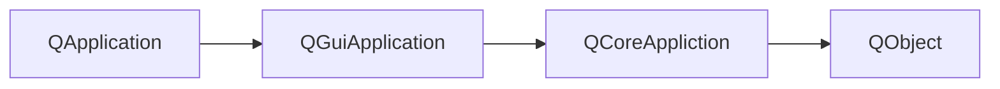
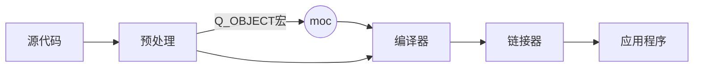
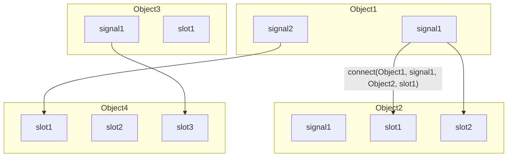

## Qt主事件循环

- QObject：包含Qt的元对象(meta object)系统
- QCoreApplication：为非GUI应用程序提供主事件循环
- QGuiApplication：为GUI应用程序提供主事件循环
- QApplication：为Qt Widgets模块的应用程序提供主事件循环

> ​	QCoreApplication 包含主事件循环，处理和分发来自操作系统和其他源的所有事件。它还处理应用程序的初始化和终结，以及系统范围和应用程序范围的设置
>
> ​	QGuiApplication 除了继承QCoreAplication的功能以外，还需负责初始化GUI所需的资源；跟踪系统界面属性，保证GUI与系统设置保持一致；提供字符串本地化、剪贴板，鼠标光标处理等功能。qGuiApp 是表示QGuiApplication对象的全局单例指针，当应用程序对象是QGuiApplication时有效。
>
> ​	QApplication 负责继承初始化Qt Widgets模块所需的资源，并提供更多的接口；QGuiAppliction 更多的使用操作系统本身的接口，比较轻量级。 qApp 是应用程序对象的全局指针
>
> ​	调用exec()方法进入主事件循环，直到调用exit()



​	`qDebug()`：在windows下，如果是控制台应用程序，则将消息发送到控制台；否则，它将被发送到调试器。

## 元对象系统(Meta-Object System)

- Qt 对标准C++进行了拓展，引入了一些新的概念和功能：

  - 信号槽机制
  - 属性
  - 内存管理

- QObject类是所有使用元对象系统的类的基类

  - 并不是所有Q开头的类都是QObject的派生类，例如QString

- 在一个类的private部分声明Q_OBJECT宏

- MOC(元对象编译器)为每个QObject的子类提供必要的代码

  - 元对象编译器(Meta-Object Compiler, MOC) 是一个预处理器，先将Qt的特性程序转换为标准C++程序，再由C++编译器进行编译。只有添加了Q_OBJECT宏，MOC才会对类里的信号和槽进行预处理。

  > 在Qt程序中，不管是否会用到信号槽机制，都最好加上Q_OBJECT宏
  >
  > Qt为C++语言增加的特性在Qt Core模块里实现，由Qt的元对象系统实现



### QObject不支持拷贝

QObject的拷贝构造函数和赋值运算符是私有的，并且使用了Q_DISABLE_COPY()宏。

> 为什么不支持拷贝：
>
>   QObject 做了很多额外的工作，如果可以拷贝则需要考虑很多东西，例如：
>
> - QObject::objectName可能是唯一的，如果复制一个Qt对象，应该给副本取什么名字
> - 复制的Qt对象在对象层次结构中，应该放在什么位置
> - Qt对象可以连接到其他对象向其发射信号和接受信号。如果复制Qt对象，该如何处理这些连接关系
> - 可以在运行时添加未在C++类中声明新新属性。如果我们复制一个Qt对象，那么副本是否应该包括添加到原始对象中的属性
>
> 为了简单起见，干脆就不支持拷贝

### QObject的组织方式：对象树

- 当以另一个对象作为父对象创建QObject时，该对象将自动建家自身到父对象的子对象列表中
- 父对象删除时，它将自动删除其子对象。可以使用findChild()或findChildren()按名称和可选类型查找对象

> 如果只是需要通过QObject自动回收内存，无需moc系统，即无需添加Q_OBJECT。
>
> ​	虽然不是必须的，但仍建议在所有QObject子类中加上Q_OBJECT

## 信号与槽

​	所有GUI应用程序都是事件驱动的。事件主要有应用程序的用户生成，但也可以通过其它方式生成，例如Internet连接、窗口管理器或计时器。

   Qt具有独特的信号与插槽机制，它被用于对象之间的通信。solt是一种普通的C++函数：当与之相连的信号发出时，调用它。下面的图表示了信号与槽的调用关系



​    有几种连接信号和槽的方法：

- 使用成员函数指针(推荐)

  `connect(sender, &QObject::destroyed, this, &MyObject::objectDestroyed);`

  优点：允许编译器检查信号是否与槽的参数兼容；编译器可以隐式转换参数

- 使用仿函数或lambda表达式作为slot

  `connect(sender, &QObject::destoryed, this, [=](){this-> m_objects.remove(sender);});`

- 使用SIGNAL和SOLT宏

  如果参数具有默认值，传递给SIGNAL()宏的签名的参数不得少于传递给SLOT()宏的签名的参数

  ```c++
  connect(sender, SIGNAL(destroyed(QObject*)), 
          this, SLOT(objectDestroyed(QObject*)));
  ```

  